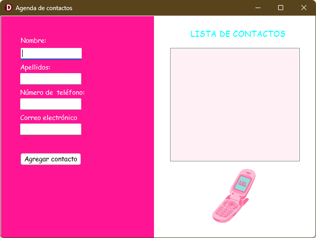
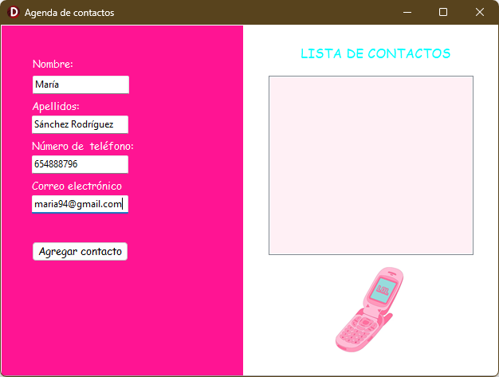
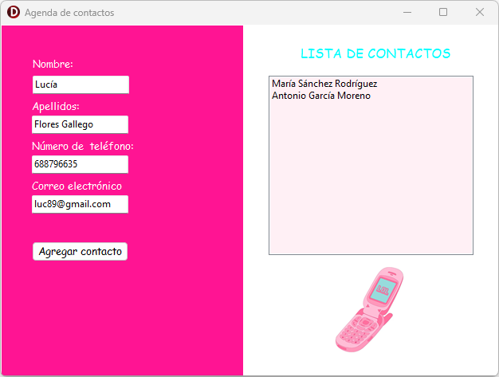

# Agenda Y2K 📟✨

Aplicación desarrollada en Delphi con estética **Y2K** para la gestión de contactos.

## ✨ Características
- Agregar, editar y eliminar contactos.
- Interfaz retro inspirada en el año 2000.

## 🛠️ Tecnologías
- Delphi VCL
- Pascal orientado a objetos

